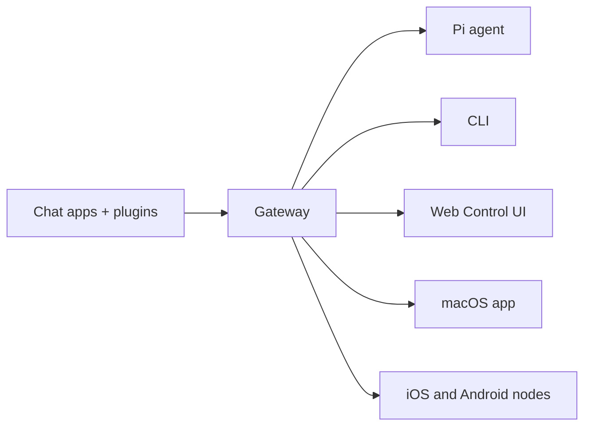
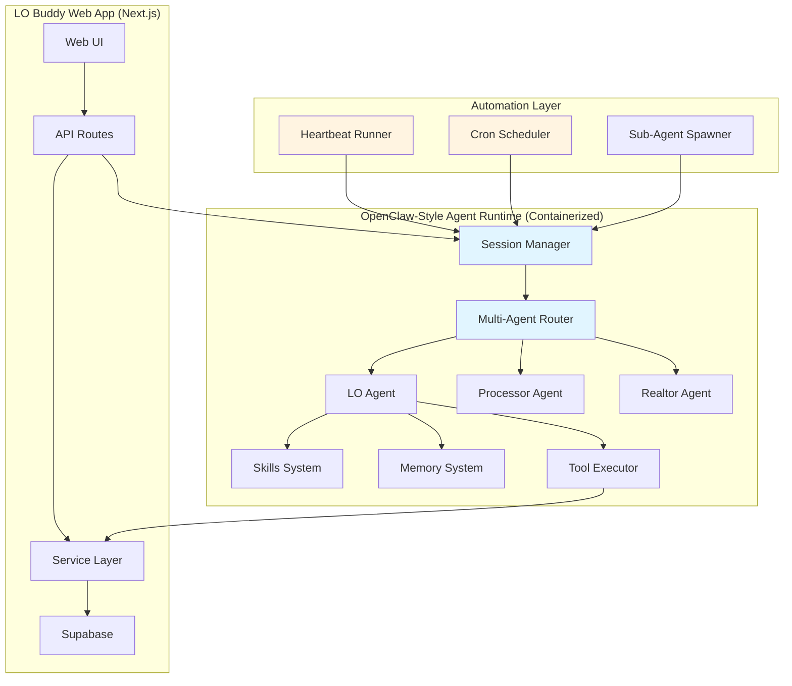

# LO Buddy Deep Dive Briefing

**Prepared for:** Kyle Palaniuk  
**Meeting:** Brad & Chad Discussion (Tomorrow, 9:30 AM)  
**Date:** February 10, 2026  
**Prepared by:** OpenClaw AI Research Agent

---

## Executive Summary

**LO Buddy** is an AI-powered sales retention assistant for mortgage loan officers, built on Next.js 14 with Supabase and OpenAI GPT-5. The system prevents the "leaky bucket problem" where deals fall through the cracks by proactively surfacing stale opportunities and automating follow-up workflows.

**Current State:** MVP-ready architecture with 43 database migrations, 9 AI tools, voice interface, and modular agent system in development. Pilot customer: San Diego Mortgage Company (SDMC).

**OpenClaw Integration Opportunity:** OpenClaw's multi-channel gateway architecture and session management could be adapted to provide LO Buddy with enterprise-grade agent orchestration, multi-user isolation, and extensible skill system — all while maintaining containerized security boundaries.

---

## Table of Contents

1. [What LO Buddy Is & Does](#1-what-lo-buddy-is--does)
2. [Current Tech Stack & Architecture](#2-current-tech-stack--architecture)
3. [Key Features: Built vs Planned](#3-key-features-built-vs-planned)
4. [OpenClaw Architecture Overview](#4-openclaw-architecture-overview)
5. [Integration Strategy: OpenClaw Patterns in LO Buddy](#5-integration-strategy-openclaw-patterns-in-lo-buddy)
6. [Key Questions & Talking Points](#6-key-questions--talking-points)

---

## 1. What LO Buddy Is & Does

### The Problem: Leaky Bucket

Mortgage loan officers lose deals because:
- **New leads get forgotten** in the chaos of daily operations
- **Deals go stale** while waiting for borrower action
- **Follow-ups slip through** the cracks
- **No one notices** when something needs urgent attention

Example: "Anderson hasn't been touched in 5 days and they're Pre-Qualified — you should call today"

### The Solution: Proactive AI Sales Assistant

LO Buddy is **NOT** just a CRM with voice. It's an AI-powered **retention engine** that:

1. **Sniffs out staleness** — Detects deals going cold based on status + inactivity
2. **Generates follow-up strategies** — Not generic reminders, but contextual action plans per lead
3. **Surfaces urgency** — "Thompson's rate lock expires in 4 days — action needed"
4. **Suggests interventions** — "3 deals went cold last month — here's a re-engagement approach"

### Core Philosophy

> **AI Suggests → Human Approves**

The AI:
- ✅ Parses voice commands into structured data
- ✅ Suggests next actions
- ✅ Validates requirement completeness
- ✅ Extracts entities from natural language
- ✅ Generates summaries and drafts

The AI does NOT:
- ❌ Auto-execute status changes without confirmation
- ❌ Send communications without approval
- ❌ Override human judgment
- ❌ Modify financial data without validation

### MVP Funnel Definition

**Goal:** Lead Capture → Application Submitted = WIN

**In Scope (MVP):**
- Lead capture (voice + form)
- Lead qualification flow
- Communication logging (calls/texts/emails)
- Realtor dashboard (referral visibility)
- Voice commands that work reliably
- Pre-qual scenario creation & sharing
- Application submitted = success metric

**Out of Scope (Post-MVP):**
- Document collection/OCR
- ARIVE integration (loan origination sync)
- Advanced analytics
- Team chat (Slack-like)
- Post-application processing
- Full ReFi Machine merger

---

## 2. Current Tech Stack & Architecture

### Technology Stack

| Layer | Technology | Version |
|-------|------------|---------|
| **Framework** | Next.js (App Router) | 14.2 |
| **Language** | TypeScript | 5.6 |
| **Database** | Supabase (PostgreSQL) | Latest |
| **Auth** | Supabase Auth (SSR) | Latest |
| **UI** | React + Tailwind CSS + Radix UI | 18.3 / 3.4 |
| **State** | Zustand + TanStack Query | Latest |
| **AI** | OpenAI GPT-5 (tool-calling) | GPT-5 |
| **Forms** | React Hook Form + Zod | Latest |
| **Real-time** | Supabase WebSockets | Latest |

### Folder Structure (Strict Conventions)

```
lobuddy/
├── app/                          # Next.js App Router
│   ├── (auth)/                   # Protected routes (require login)
│   │   ├── opportunities/        # Pipeline management
│   │   ├── contacts/             # Contact management
│   │   ├── tasks/                # Task management
│   │   └── realtor/              # Realtor portal views
│   ├── (public)/                 # Public routes (no auth)
│   │   ├── landing/              # Marketing page
│   │   ├── login/ signup/        # Auth flows
│   │   └── client/               # Client/borrower portal
│   └── api/                      # API Route Handlers
│       ├── voice/                # AI voice endpoints
│       ├── opportunities/        # Opportunity CRUD
│       └── [domain]/             # Other domain APIs
│
├── components/                   # React Components
│   ├── ui/                       # Radix-based primitives
│   ├── opportunities/            # 39 opportunity-specific files
│   ├── contacts/                 # Contact-specific
│   ├── voice/                    # Voice commander UI
│   └── scenarios/                # Loan scenario UI
│
├── services/                     # Business Logic Layer
│   ├── opportunity.service.ts    # Opportunity operations
│   ├── tool-calling-agent.service.ts  # Main AI agent (~2,950 lines)
│   ├── command-execution.service.ts   # Voice command execution
│   ├── scenario.service.ts       # Loan scenario logic
│   └── [domain].service.ts       # Other domain services
│
├── lib/                          # Utilities & Configuration
│   ├── supabase/                 # DB client setup
│   ├── llm/                      # OpenAI integration
│   │   ├── client.ts             # OpenAI client
│   │   ├── prompt-cache.ts       # System prompt builder
│   │   ├── tool-schemas.ts       # Tool definitions (9 tools)
│   │   └── tool-executor.ts      # Tool execution
│   ├── auth/                     # Auth utilities
│   ├── constants/                # Centralized constants
│   └── encryption/               # PII encryption (placeholder)
│
├── types/                        # TypeScript Definitions
│   ├── opportunity.types.ts
│   ├── contact.types.ts
│   └── [domain].types.ts
│
├── supabase/migrations/          # 43 SQL migration files
│
└── modelinfo/                    # AI Configuration
    ├── LOBUDDY_PERSONA.json      # AI personality
    ├── LOBUDDY_STAGES.json       # Status flow & requirements
    ├── LOBUDDY_PERMISSIONS.json  # Role permissions
    └── LOBUDDY_SLA_CONFIG.json   # SLA thresholds
```

### Request Flow Architecture

```
User Action
    ↓
React Component (components/)
    ↓
Custom Hook (hooks/) or direct fetch
    ↓
API Route (app/api/)
    ↓
Service Layer (services/)
    ↓
Supabase Client (lib/supabase/)
    ↓
PostgreSQL + RLS
```

### Voice Command Flow

```
User Speech
    ↓
Transcription API (/api/voice/transcribe)
    ↓
Tool-Calling Agent (/api/voice/chat)
    ↓
OpenAI GPT-5 (selects tool + extracts entities)
    ↓
Tool Executor (validates + executes)
    ↓
GPT generates natural response
    ↓
UI displays result
```

### Data Model (Core Entities)

```
CONTACT (Person/Couple)
  ├── OPPORTUNITIES (Loan opportunities)
  │    ├── SCENARIOS (Loan options)
  │    ├── ACTIVITIES (Timeline)
  │    ├── TASKS (Action items)
  │    └── NOTES (Context)
  └── PROPERTIES (Real estate owned)
```

### Key Database Tables

| Table | Purpose | Key Fields |
|-------|---------|------------|
| `users` | App users (LOs, admins, realtors) | `id`, `email`, `role`, `first_name`, `last_name` |
| `contacts` | Borrowers/clients | `id`, `first_name`, `last_name`, `email`, `phone`, `assigned_to` |
| `opportunities` | Loan deals | `id`, `contact_id`, `status`, `type`, `assigned_to`, `ball_in_court` |
| `scenarios` | Loan options | `id`, `opportunity_id`, `loan_amount`, `rate`, `term`, `is_selected` |
| `tasks` | Action items | `id`, `opportunity_id`, `assigned_to`, `due_date`, `completed_at` |
| `activities` | Audit trail | `id`, `opportunity_id`, `user_id`, `action_type`, `details` |
| `notes` | Free-form notes | `id`, `opportunity_id`, `content`, `created_by` |

### Status Lifecycle (13 Stages)

```
NEW_LEAD → CONTACTED → PRE_QUALIFIED → PRE_APPROVED → 
SEARCHING/READY → UNDER_CONTRACT → SEND_TO_PROCESSING → 
IN_PROCESSING → SUBMITTED_TO_UW → CONDITIONS_ISSUED → 
CLEAR_TO_CLOSE → FUNDED ✓

Side statuses: CANCELLED, DEAD, ON_HOLD
```

Each status has entry requirements defined in `LOBUDDY_STAGES.json`.

### AI System: The 9 Tools

```typescript
const LOBUDDY_TOOLS = [
  'create_lead',           // Create new contact/opportunity
  'manage_opportunity',    // Status, notes, tasks, assignments
  'manage_contact',        // Fetch or update contact info
  'fetch_opportunity',     // Read-only queries
  'get_pipeline_summary',  // Pipeline overview
  'get_tasks',             // User's task list
  'get_advice',            // AI recommendations, drafts
  'create_scenario',       // Loan scenario calculator
  'search_opportunities',  // Find deals by criteria
];
```

### AI Persona (from LOBUDDY_PERSONA.json)

```json
{
  "name": "LO.Buddy",
  "motto": "Let's close this thing.",
  "assertiveness_level": 8,
  "personality": [
    "Brilliant junior colleague - knows everything but defers to user's judgment",
    "Proactive coach - nudges, reminds, and suggests next steps",
    "Commanding knowledge base - instant access to guidelines, calculations"
  ]
}
```

---

## 3. Key Features: Built vs Planned

### ✅ Currently Built & Working

#### Core Infrastructure
- ✅ **Next.js 14 App** — Full-stack web app with App Router
- ✅ **43 Database Migrations** — 31+ tables with RLS policies
- ✅ **Supabase Auth** — SSR authentication with role-based access
- ✅ **Monolithic AI Agent** — 2,950-line tool-calling agent with 9 tools
- ✅ **Voice Interface** — Whisper transcription + GPT tool execution
- ✅ **Auto-Task System** — Creates follow-up tasks on status changes
- ✅ **Voice Context Integration** — AI understands "this deal" when viewing opportunity

#### User Portals
- ✅ **LO Dashboard** — Pipeline view, opportunity management
- ✅ **Realtor Portal** — Submit leads, view referral status
- ✅ **Client/Borrower Portal** — View scenarios, application status
- ✅ **Basic Notifications** — Activity tracking

#### Domain Logic
- ✅ **Status Workflows** — 13-stage opportunity lifecycle
- ✅ **Scenario Calculator** — Basic pre-qual scenarios
- ✅ **Contact Management** — Search, create, link relationships
- ✅ **Activity Timeline** — Full audit trail per opportunity
- ✅ **Ball-in-Court Tracking** — Ownership transfers on status changes

### 🔄 Currently In Development

#### 1. Modular Agent System (PRIMARY FOCUS)

**Problem:** 2,950-line monolithic agent is hard to maintain and extend.

**Solution:** 5 specialized modules with rules-based orchestrator:

| Module | Purpose | Status |
|--------|---------|--------|
| **Capture** | Ultra-fast lead creation, minimal friction | Spec complete |
| **Follow-Up Coach** | Proactive follow-up strategies per lead | Spec complete |
| **Qualify** | Discovery call guidance, pre-qual scenarios | Spec complete |
| **Validator** | Data completeness, status transition checks | Spec complete |
| **Realtor** | Partner-appropriate comms & data filtering | Spec complete |

**Architecture Decision:**
- Rules-based orchestrator (NOT another LLM call)
- UI buttons set `moduleHint` to bypass orchestration
- One LLM call per interaction with module-composed prompt
- Zero additional API cost for routing

**Full spec:** `context/AGENT_MODULES_CONTEXT.md` (37KB comprehensive doc)

#### 2. Mobile UI Overhaul (Chad's Focus)

- Quick-action bar: `[➕ Lead] [📞 Log Call] [💬 Text] [🎤 Voice]`
- Notification/suggestion cards from Follow-Up Coach
- Modules integrate via `moduleHint` parameter on UI buttons

#### 3. LO Ninja Integration (Phase 8 — Paused)

- GoHighLevel API for CRM connectivity
- Need custom field ID mappings from Brad
- Webhooks for ContactCreate/ContactUpdate events
- RSA SHA256 signature verification

### 🔮 Post-MVP Roadmap

| Feature | Priority | Spec Status |
|---------|----------|-------------|
| **ReFi Machine Merger** | High | 17-day plan complete |
| **LO Ninja Full Integration** | High | Waiting on custom fields |
| **Document OCR** | Medium | Spec backlog |
| **Advanced Analytics** | Medium | Spec backlog |
| **Team Chat (Slack-like)** | Medium | Deferred to post-MVP |
| **ARIVE Integration** | Low | Loan origination system sync |

---

## 4. OpenClaw Architecture Overview

### What is OpenClaw?

**OpenClaw** is a self-hosted, multi-channel gateway for AI agents that runs on any OS. It connects chat apps (WhatsApp, Telegram, Discord, iMessage) to AI coding agents with tool use, sessions, memory, and multi-agent routing.

**Key Differentiators:**
- ✅ Self-hosted (runs on your hardware, your rules)
- ✅ Multi-channel (one Gateway serves multiple messaging platforms simultaneously)
- ✅ Agent-native (built for coding agents with tool use, sessions, memory)
- ✅ Multi-agent routing (isolated sessions per agent, workspace, or sender)
- ✅ Open source (MIT licensed, community-driven)

### Core Architecture



### Gateway Components

1. **Gateway (daemon)**
   - Maintains provider connections
   - Exposes typed WebSocket API
   - Validates inbound frames against JSON Schema
   - Emits events: `agent`, `chat`, `presence`, `health`, `heartbeat`, `cron`

2. **Clients (mac app / CLI / web admin)**
   - One WebSocket connection per client
   - Send requests (`health`, `status`, `send`, `agent`, `system-presence`)
   - Subscribe to events (`tick`, `agent`, `presence`, `shutdown`)

3. **Nodes (macOS / iOS / Android / headless)**
   - Connect with `role: node`
   - Provide device identity (device-based pairing)
   - Expose commands: `canvas.*`, `camera.*`, `screen.record`, `location.get`

### Session Management

**Key Concept:** One direct-chat session per agent as primary.

**Session Keys:**
- Direct chats: `agent:<agentId>:<mainKey>` (default `main`)
- Group chats: `agent:<agentId>:<channel>:group:<id>`
- Cron jobs: `cron:<job.id>`
- Webhooks: `hook:<uuid>`
- Sub-agents: `agent:<agentId>:subagent:<uuid>`

**Session Isolation Modes:**
- `main` (default): all DMs share main session for continuity
- `per-peer`: isolate by sender ID across channels
- `per-channel-peer`: isolate by channel + sender (recommended for multi-user)
- `per-account-channel-peer`: isolate by account + channel + sender

**Lifecycle:**
- Daily reset: 4:00 AM local time on gateway host (configurable)
- Idle reset: optional sliding window (`idleMinutes`)
- Manual reset: `/new` or `/reset` commands

### Agent Runtime

**Workspace Contract (Required):**

OpenClaw uses a single agent workspace directory as the agent's working directory.

**Bootstrap Files (Injected):**
- `AGENTS.md` — operating instructions + "memory"
- `SOUL.md` — persona, boundaries, tone
- `TOOLS.md` — user-maintained tool notes
- `BOOTSTRAP.md` — one-time first-run ritual
- `IDENTITY.md` — agent name/vibe/emoji
- `USER.md` — user profile + preferred address

**Memory System:**
- `memory/YYYY-MM-DD.md` — Daily log (append-only)
- `MEMORY.md` — Curated long-term memory (main session only)
- Memory search tools via active memory plugin (default: `memory-core`)
- Vector search with sqlite-vec acceleration
- Automatic pre-compaction memory flush

### Multi-Agent Routing

**Concept:** Multiple isolated agents (separate workspace + auth + sessions) in one Gateway.

**Routing Rules (Deterministic, Most-Specific Wins):**
1. `peer` match (exact DM/group/channel ID)
2. `guildId` (Discord)
3. `teamId` (Slack)
4. `accountId` match for a channel
5. Channel-level match (`accountId: "*"`)
6. Fallback to default agent

**Example: Two WhatsApps → Two Agents**

```json5
{
  agents: {
    list: [
      {
        id: "home",
        workspace: "~/.openclaw/workspace-home",
        agentDir: "~/.openclaw/agents/home/agent",
      },
      {
        id: "work",
        workspace: "~/.openclaw/workspace-work",
        agentDir: "~/.openclaw/agents/work/agent",
      },
    ],
  },
  bindings: [
    { agentId: "home", match: { channel: "whatsapp", accountId: "personal" } },
    { agentId: "work", match: { channel: "whatsapp", accountId: "biz" } },
  ],
}
```

### Skills System

**Skills** are AgentSkills-compatible folders that teach the agent how to use tools.

**Locations and Precedence:**
1. Workspace skills: `<workspace>/skills` (highest)
2. Managed/local: `~/.openclaw/skills`
3. Bundled skills: shipped with install (lowest)

**Load-Time Gating:**
- `metadata.openclaw.requires.bins` — binary must exist on PATH
- `metadata.openclaw.requires.env` — env var must exist
- `metadata.openclaw.requires.config` — config path must be truthy
- `metadata.openclaw.os` — platform filter

**Example Skill Metadata:**

```markdown
---
name: gemini
description: Use Gemini CLI for coding assistance
metadata:
  {
    "openclaw": {
      "emoji": "♊️",
      "requires": { "bins": ["gemini"] },
      "install": [
        {
          "kind": "brew",
          "formula": "gemini-cli",
          "bins": ["gemini"],
        },
      ],
    },
  }
---
```

### Automation: Cron vs Heartbeat

#### Heartbeat: Periodic Awareness

- Runs in **main session** at regular interval (default: 30 min)
- Designed for agent to check on things and surface anything important
- Batches multiple checks (inbox, calendar, notifications) in one turn
- Context-aware decisions with full session history
- Reduces API calls vs multiple isolated cron jobs

**Use Cases:**
- Check inbox every 30 min
- Monitor calendar for upcoming events
- Background project health check

**Configuration:**

```json5
{
  agents: {
    defaults: {
      heartbeat: {
        every: "30m",
        target: "last",
        activeHours: { start: "08:00", end: "22:00" },
      },
    },
  },
}
```

#### Cron: Precise Scheduling

- Runs at **exact times** with 5-field cron expressions
- Can run in isolated sessions (`cron:<jobId>`)
- Optional delivery modes: `announce` or `none`
- Model overrides per job

**Use Cases:**
- Send daily report at 9am sharp
- Weekly deep analysis with Opus model
- One-shot reminders ("remind me in 20 minutes")

**Example:**

```bash
openclaw cron add \
  --name "Morning briefing" \
  --cron "0 7 * * *" \
  --tz "America/New_York" \
  --session isolated \
  --message "Generate briefing: weather, calendar, emails" \
  --model opus \
  --announce \
  --channel whatsapp \
  --to "+15551234567"
```

### Sub-Agents

**Concept:** Spawn isolated agent runs for background tasks that announce results back.

**Use Cases:**
- Research a topic while main agent continues
- Run multiple long tasks in parallel
- Delegate to specialized agents in multi-agent setup

**Flow:**
1. Main agent calls `sessions_spawn` (non-blocking)
2. Sub-agent runs in `agent:<agentId>:subagent:<uuid>` session
3. Result announced back to requester chat
4. Session auto-archived after 60 minutes

**Configuration:**

```json5
{
  agents: {
    defaults: {
      subagents: {
        model: "minimax/MiniMax-M2.1",  // Use cheaper model
        maxConcurrent: 8,
        archiveAfterMinutes: 60,
      },
    },
  },
}
```

### Sandboxing

**Purpose:** Run untrusted code in isolated Docker containers.

**Modes:**
- `off` — No sandboxing (default)
- `untrusted` — Only untrusted sources (manual approval gate)
- `all` — Always sandbox

**Scopes:**
- `shared` — One container per Gateway, shared across agents
- `agent` — One container per agent, persistent across sessions
- `session` — Ephemeral container per session

**Configuration:**

```json5
{
  agents: {
    defaults: {
      sandbox: {
        mode: "all",
        scope: "agent",
        docker: {
          setupCommand: "apt-get update && apt-get install -y git curl",
        },
      },
    },
  },
}
```

---

## 5. Integration Strategy: OpenClaw Patterns in LO Buddy

### Overview: Why OpenClaw Patterns Matter

LO Buddy is currently a **monolithic web application** with a single AI agent. As it scales to handle:
- Multiple loan officers with isolated data
- Multiple LO assistants, processors, and realtors
- Multiple communication channels (SMS, email, voice, chat)
- Background automation (follow-up reminders, stale deal detection)

...it will benefit from the **architectural patterns** OpenClaw has proven at scale.

### Key OpenClaw Patterns to Adapt

#### 1. Session Management & Isolation

**OpenClaw Pattern:**
```
agent:<agentId>:<mainKey>               # Main conversation
agent:<agentId>:<channel>:group:<id>    # Group isolation
agent:<agentId>:dm:<peerId>             # Per-peer isolation
```

**LO Buddy Adaptation:**
```
lo:<userId>:main                        # LO's main chat
lo:<userId>:opp:<opportunityId>         # Per-opportunity context
lo:<userId>:realtor:<realtorId>         # Realtor partnership chat
processor:<userId>:main                 # Processor's isolated view
```

**Benefits:**
- ✅ Each LO gets isolated conversation context
- ✅ Opportunity-specific chat threads preserve context
- ✅ Realtors get filtered, partner-appropriate views
- ✅ Processors only see their assigned deals

**Implementation:**
- Add `session_key` to database schema
- Modify AI agent to accept `sessionKey` parameter
- Route API calls based on user role + context
- Store transcripts per session: `sessions/<sessionKey>.jsonl`

#### 2. Multi-Agent Routing

**OpenClaw Pattern:**
```json5
{
  agents: {
    list: [
      { id: "main", workspace: "~/.openclaw/workspace-main" },
      { id: "processor", workspace: "~/.openclaw/workspace-processor" },
    ],
  },
  bindings: [
    { agentId: "processor", match: { peer: { kind: "direct", id: "processor@example.com" } } },
  ],
}
```

**LO Buddy Adaptation:**

```json5
{
  agents: {
    list: [
      {
        id: "loan-officer",
        persona: "LOBUDDY_PERSONA.json",
        tools: ["create_lead", "manage_opportunity", "get_pipeline_summary"],
      },
      {
        id: "processor",
        persona: "PROCESSOR_PERSONA.json",
        tools: ["manage_opportunity", "update_conditions", "submit_to_uw"],
      },
      {
        id: "realtor",
        persona: "REALTOR_PERSONA.json",
        tools: ["submit_referral", "check_status", "request_pre_approval"],
      },
    ],
  },
  bindings: [
    { agentId: "loan-officer", match: { role: "loan_officer" } },
    { agentId: "processor", match: { role: "processor" } },
    { agentId: "realtor", match: { role: "realtor" } },
  ],
}
```

**Benefits:**
- ✅ Each role gets specialized AI persona and tool access
- ✅ Realtors can't accidentally see PII
- ✅ Processors get guided workflow for their specific stage
- ✅ Deterministic routing prevents access control bugs

**Implementation:**
- Create separate persona configs per role
- Implement role-based tool filtering
- Add `agentId` to user session
- Route requests through agent selector middleware

#### 3. Skills System for Extensibility

**OpenClaw Pattern:**

```
workspace/skills/
├── mortgage-calculator/
│   ├── SKILL.md          # Instructions + metadata
│   └── calculate.sh      # Optional binary
└── credit-check/
    ├── SKILL.md
    └── check-credit.py
```

**LO Buddy Adaptation:**

```
workspace/skills/
├── pre-approval-letter/
│   ├── SKILL.md          # How to generate pre-approval letters
│   └── template.html     # Letter template
├── scenario-calculator/
│   ├── SKILL.md          # PITIMIA calculations
│   └── rates.json        # Current rate table
└── realtor-outreach/
    ├── SKILL.md          # Realtor communication templates
    └── templates/        # Email templates
```

**Benefits:**
- ✅ LO domain expertise encapsulated in reusable skills
- ✅ Easy to add new loan programs (VA, FHA, USDA)
- ✅ Skills can be version-controlled and shared across team
- ✅ Non-developers (like Kyle) can edit skill instructions

**Implementation:**
- Create `workspace/skills/` directory structure
- Load skills at agent init time
- Inject skill instructions into system prompt
- Skills can reference local binaries (e.g., PDF generator)

#### 4. Automation: Heartbeat + Cron

**OpenClaw Pattern:**

**Heartbeat (batched checks):**
```markdown
# HEARTBEAT.md

- Check for stale opportunities (no activity >5 days)
- Surface rate lock expirations (<7 days)
- Detect forgotten new leads (>24 hours)
- Suggest re-engagement for dead deals (>30 days)
```

**Cron (precise schedules):**
```bash
# Daily morning briefing at 7am
openclaw cron add \
  --name "LO daily brief" \
  --cron "0 7 * * *" \
  --message "Summarize: top priorities, expiring rate locks, new leads" \
  --announce
```

**LO Buddy Adaptation:**

**Heartbeat Checks (every 30 min):**
- Stale opportunities detection (status + days inactive)
- Rate lock expiration warnings (<7 days)
- New lead notifications (>2 hours uncontacted)
- Processor handoff reminders
- Realtor update cadence checks

**Cron Jobs:**
- **Daily 7am:** LO priority list + urgent items
- **Weekly Monday 9am:** Pipeline review + stale deal report
- **Every Friday 5pm:** Weekly summary email
- **One-shot:** "Remind me to follow up with Anderson in 2 hours"

**Benefits:**
- ✅ Replaces manual checking with proactive AI monitoring
- ✅ Reduces API calls (one heartbeat vs 10 separate queries)
- ✅ Precise timing for reports and reminders
- ✅ Context-aware (AI knows what's urgent based on session history)

**Implementation:**
- Add `HEARTBEAT.md` to LO workspace
- Create cron job scheduler service
- Store cron jobs in database (`cron_jobs` table)
- Execute via background worker (could use Supabase Edge Functions)

#### 5. Sub-Agents for Background Tasks

**OpenClaw Pattern:**

```bash
# Main agent spawns sub-agent
> "Spawn a sub-agent to analyze this month's conversion rates"

# Sub-agent runs in background
agent:main:subagent:a1b2c3d4...

# Sub-agent announces result back
> "Analysis complete: Your conversion rate dropped 12% vs last month..."
```

**LO Buddy Adaptation:**

**Use Cases:**
- **Deep pipeline analysis:** "Analyze why my Q1 conversion rate dropped"
- **Lead research:** "Research the Smith family's property history"
- **Document processing:** "Extract data from these 5 uploaded bank statements"
- **Scenario generation:** "Build 10 scenarios comparing different rate/term combos"

**Benefits:**
- ✅ Main chat stays responsive during long-running tasks
- ✅ Multiple background tasks can run in parallel
- ✅ LO can continue working while AI processes data
- ✅ Sub-agents can use different models (cheaper for bulk work)

**Implementation:**
- Add `sessions_spawn` tool to LO Buddy
- Create background job queue (use Supabase Realtime or BullMQ)
- Store sub-agent sessions: `subagent:<opportunityId>:<taskId>`
- Announce results back to main session when complete

#### 6. Memory System

**OpenClaw Pattern:**

```
workspace/
├── MEMORY.md              # Long-term curated memory
└── memory/
    ├── 2026-02-10.md     # Today's log
    └── 2026-02-09.md     # Yesterday's log
```

**LO Buddy Adaptation:**

```
workspace/
├── MEMORY.md              # LO's preferences, strategies, key clients
└── memory/
    ├── 2026-02-10.md     # Today's interactions
    ├── opportunities/
    │   └── <uuid>.md     # Per-opportunity notes
    └── contacts/
        └── <uuid>.md     # Per-contact relationship notes
```

**Benefits:**
- ✅ AI remembers LO's preferences ("Always suggest 30-year fixed first")
- ✅ Opportunity-specific context persists across sessions
- ✅ Contact relationship history ("Referred by top realtor Kevin McCarthy")
- ✅ Vector search enables semantic recall ("Who was that client with the VA loan?")

**Implementation:**
- Create `workspace/memory/` directory structure
- Write to daily log on every significant interaction
- Implement vector search over memory files (use OpenAI embeddings)
- Add `memory_search` and `memory_get` tools to AI

### Architecture Diagram: Hybrid Approach



**Key Integration Points:**

1. **API Routes → Session Manager**
   - Web app sends user messages to session manager
   - Session manager routes to appropriate agent
   - Agent executes tools via service layer

2. **Tool Executor → Service Layer**
   - Agent tools call existing LO Buddy services
   - No duplication of business logic
   - Services remain single source of truth

3. **Automation Layer → Session Manager**
   - Heartbeat triggers proactive checks
   - Cron executes scheduled tasks
   - Sub-agents handle background work

### Security & Isolation Strategy

**Critical Requirement:** LO Buddy handles PII and financial data. The agent runtime MUST be containerized.

**Containerization Approach (Docker-based):**

```yaml
# docker-compose.yml (simplified)
services:
  agent-runtime:
    image: lobuddy-agent:latest
    volumes:
      - ./workspace:/workspace:rw
      - ./skills:/skills:ro
    environment:
      - OPENAI_API_KEY=${OPENAI_API_KEY}
      - SUPABASE_URL=${SUPABASE_URL}
      - SUPABASE_ANON_KEY=${SUPABASE_ANON_KEY}
    networks:
      - lobuddy-internal
    restart: unless-stopped
```

**Security Boundaries:**

1. **Network Isolation:**
   - Agent runtime on internal Docker network
   - Only exposes API endpoint to Next.js app
   - No direct internet access (except OpenAI API)

2. **Filesystem Isolation:**
   - Workspace mounted read-write
   - Skills mounted read-only
   - No access to host filesystem

3. **Tool Sandboxing:**
   - `exec` tool disabled by default
   - File writes restricted to workspace
   - Database access via service layer only (no direct DB creds)

4. **Per-LO Isolation:**
   - Each LO gets own workspace directory
   - Session keys enforce data isolation
   - RLS policies on Supabase side as additional layer

**Example: Per-LO Agent Configuration**

```json5
{
  agents: {
    list: [
      {
        id: "lo-mike",
        workspace: "/workspace/mike-smith",
        tools: {
          allow: ["read", "sessions_list", "sessions_send"],
          deny: ["exec", "write", "edit"],
        },
        sandbox: {
          mode: "all",
          scope: "agent",
        },
      },
      {
        id: "lo-tracy",
        workspace: "/workspace/tracy-jones",
        tools: {
          allow: ["read", "sessions_list", "sessions_send"],
          deny: ["exec", "write", "edit"],
        },
        sandbox: {
          mode: "all",
          scope: "agent",
        },
      },
    ],
  },
}
```

### Implementation Phases (Proposed)

#### Phase 1: Foundation (2-3 weeks)
- [ ] Add session management to database schema
- [ ] Implement session key routing in API layer
- [ ] Create workspace directory structure per LO
- [ ] Port OpenClaw session manager (simplified)
- [ ] Docker containerization for agent runtime

#### Phase 2: Multi-Agent Routing (1-2 weeks)
- [ ] Implement agent registry + bindings
- [ ] Create role-based persona configs
- [ ] Add tool filtering by agent
- [ ] Test LO/Processor/Realtor isolation

#### Phase 3: Skills System (2 weeks)
- [ ] Create `workspace/skills/` structure
- [ ] Port 5 core skills (pre-approval, scenarios, etc.)
- [ ] Implement skill loading at agent init
- [ ] Test skill injection into prompts

#### Phase 4: Automation (2-3 weeks)
- [ ] Implement heartbeat runner
- [ ] Create cron scheduler service
- [ ] Add `HEARTBEAT.md` support
- [ ] Build cron job management UI

#### Phase 5: Advanced Features (2-3 weeks)
- [ ] Implement sub-agent spawning
- [ ] Add memory system with vector search
- [ ] Create proactive suggestion engine
- [ ] Polish agent UI integration

**Total Estimated Time:** 9-13 weeks for full integration

---

## 6. Key Questions & Talking Points

### For Brad (LO Ninja Integration)

1. **Custom Field Mappings:**
   - What are the custom field IDs in GoHighLevel for 1003 data?
   - Which fields store: income, assets, credit score, employment type, property details?
   - Can we get a sample webhook payload with all fields populated?

2. **Webhook Security:**
   - Confirm RSA SHA256 signature verification is required
   - Do we need to whitelist our webhook receiver IP?
   - What's the retry policy if our endpoint is down?

3. **API Rate Limits:**
   - What are the rate limits for GoHighLevel API?
   - Do we need to implement exponential backoff?
   - Can we batch requests?

4. **Bidirectional Sync:**
   - Should LO Buddy push status updates back to GoHighLevel?
   - What triggers should update GHL (status change, task completion, etc.)?
   - Do we need conflict resolution strategy?

### For Chad (Development Strategy)

1. **Modular Agent System:**
   - Should we complete the 5 modules before considering OpenClaw patterns?
   - Or should we pause modules and rebuild on OpenClaw architecture first?
   - **Recommendation:** Complete modules first (they're 80% spec'd), then layer OpenClaw patterns on top.

2. **Containerization Timeline:**
   - When should we containerize the agent runtime?
   - Should this block MVP or be post-MVP?
   - **Recommendation:** Post-MVP — current monolithic agent is fine for pilot.

3. **Multi-Tenancy Strategy:**
   - Do we need per-LO isolation for pilot (single company)?
   - Or can we defer until first multi-company customer?
   - **Recommendation:** Defer — SDMC pilot is single-company, session isolation via RLS is sufficient.

4. **OpenClaw Direct Integration vs Pattern Adoption:**
   - Should we use OpenClaw as a dependency (npm package)?
   - Or just adopt its architectural patterns?
   - **Recommendation:** Adopt patterns only — OpenClaw is designed for chat apps, LO Buddy is a web app. Take the good ideas, leave the WebSocket gateway.

### For General Discussion (Kyle + Brad + Chad)

1. **MVP Timeline:**
   - Current target: February 1, 2026 (passed)
   - Revised target for module completion?
   - Revised target for SDMC pilot launch?

2. **OpenClaw Integration Value:**
   - Is session isolation + multi-agent routing worth 9-13 weeks?
   - What's the ROI vs. just finishing modules + shipping MVP?
   - **Consideration:** OpenClaw patterns are future-proofing for multi-company scale. Not critical for single-company pilot.

3. **Domain Knowledge Bottleneck:**
   - Kyle identified 4 critical content gaps (follow-up strategies, qualification checklists, realtor templates, scenario defaults)
   - These block module effectiveness regardless of architecture
   - **Priority:** Kyle's content > architectural refactoring

4. **Resource Allocation:**
   - Should Chad focus on modules or start OpenClaw integration?
   - Should we bring in Phillip to accelerate?
   - **Recommendation:** Chad completes modules, Kyle writes domain content, consider Phillip for OpenClaw patterns post-MVP.

### Talking Points: Why OpenClaw Patterns Matter Long-Term

**For Kyle to Emphasize:**

1. **Scalability:**
   - Current monolithic approach works for 1 company
   - OpenClaw patterns enable 100+ companies on same instance
   - Session isolation prevents data leaks between customers

2. **Extensibility:**
   - Skills system lets non-developers add loan programs
   - Kyle can write `VA-LOAN.md` and agent instantly knows VA guidelines
   - Faster iteration without waiting for Chad to code

3. **Automation:**
   - Heartbeat + cron replace manual checking
   - "Set it and forget it" proactive monitoring
   - LOs get alerts only when something needs attention

4. **Developer Experience:**
   - Clean separation of concerns (routing, execution, domain logic)
   - Easier to test and debug isolated components
   - New developers can understand system faster

5. **Competitive Advantage:**
   - Most CRMs are reactive (user must check)
   - LO Buddy with OpenClaw patterns is proactive (AI surfaces issues)
   - "AI that works 24/7 so you don't have to"

### Risks & Mitigation

| Risk | Impact | Mitigation |
|------|--------|------------|
| **Over-engineering** | Delayed MVP, wasted effort | Adopt patterns incrementally, only as needed |
| **Complexity creep** | Hard to maintain | Start simple, document heavily, involve Chad early |
| **Domain knowledge gap** | Modules ineffective | Kyle writes content first, architecture second |
| **Containerization overhead** | Performance/ops complexity | Defer until multi-company customer signs |
| **OpenClaw dependency hell** | Breaking changes, maintenance burden | Don't use as dependency, just adopt patterns |

---

## Conclusion

**LO Buddy** is a well-architected AI-powered sales assistant with a clear MVP path. The modular agent system is 80% spec'd and ready for implementation.

**OpenClaw** provides proven patterns for session management, multi-agent routing, skills extensibility, and automation that could future-proof LO Buddy for enterprise scale.

**Recommended Path:**
1. **Short-term (4-6 weeks):** Complete modular agent system + Kyle's domain content
2. **Mid-term (2-3 months):** Ship SDMC pilot, gather feedback
3. **Long-term (6-12 months):** Layer OpenClaw patterns as needed for multi-company scale

**Critical Success Factors:**
- ✅ Kyle writes follow-up strategies, qualification checklists, templates
- ✅ Chad completes 5 modules (Capture, Coach, Qualify, Validator, Realtor)
- ✅ Brad provides GoHighLevel custom field mappings
- ✅ SDMC pilot validates "AI suggests → Human approves" philosophy
- ✅ OpenClaw patterns adopted incrementally, not as big-bang rewrite

**Key Insight:** OpenClaw's value isn't the WebSocket gateway or multi-channel routing (LO Buddy is a web app, not a chat app). The value is the **architectural patterns** for session isolation, multi-agent routing, extensible skills, and proactive automation. These can be adopted piecemeal as LO Buddy scales.

---

**Questions for tomorrow's meeting?**

This briefing should provide Kyle with comprehensive context for discussing both LO Buddy's current state and potential OpenClaw integration strategies with Brad and Chad.

